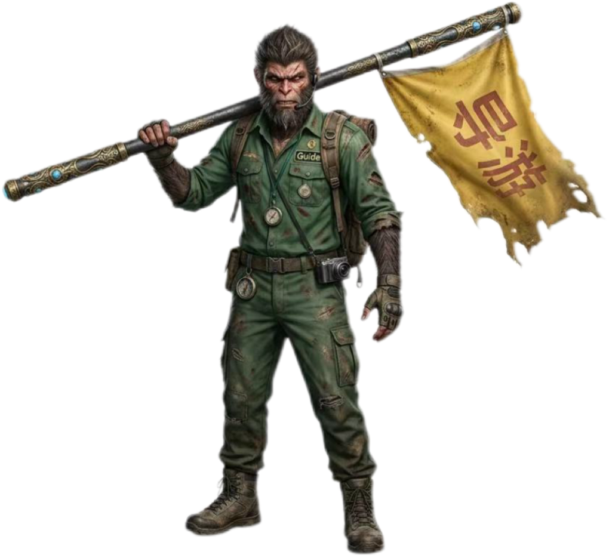

# 🎮 WukongGame: Black Myth Immersive Web & Tourism Experience

<p align="center">
  
</p>

<p align="center">
  <strong>基于《黑神话：悟空》IP的数字文旅沉浸式交互导游系统 Prototype</strong>
</p>

<p align="center">
  <a href="https://wjia061688-star.github.io/WukongGame/">🌐 访问在线体验地址 (Live Demo)</a>
</p>

---

## 📌 项目简介 (Project Overview)
本项目是一款基于前端核心技术（HTML5, CSS3, JavaScript）独立开发的《黑神话：悟空》主题沉浸式交互网页。

在设计逻辑上，项目深入结合了**文旅融合（Tourism Management）**与**数字教育（Digital EducationDivide）**的前沿理念。通过重构传统景区的“导游”角色，探讨如何利用人机协同（Human-Machine Collaborative Teaching）与虚拟现实（VR/AR）的沉浸感演算法，打破传统空间限制，为用户提供一条可交互的、具身认知的数字化文化传播路径。

## ✨ 核心亮点 (Key Features)
- **🎯 数字化文旅角色重构**：将《黑神话：悟空》核心IP具象化为数字化文旅向导（Digital Tour Guide），探索游戏叙事与景区导览的深度融合。
- **📱 响应式弹性排版**：本地精细化打磨打底，兼容多端（PC/Mobile）流式布局。
- **🎮 沉浸式交互体验**：纯前端架构构建，具备轻量级、高复用、全网零延迟响应的核心技术优势。

## 🛠️ 技术栈 (Tech Stack)
- **Frontend**: HTML5 / CSS3 (STKaiti, KaiTi Custom Typography)
- **Tools**: VS Code, Git, GitHub Desktop
- **Deployment**: GitHub Pages (Free High-Performance Cloud Hosting)

## 📁 目录结构 (Repository Structure)
```text
WukongGame/
├── index.html       # 核心交互逻辑与页面结构
├── wukong.png       # 数字化文旅向导核心资产
├── bg_bus.png       # 场景配套视觉资产
├── bg_ferry.png     # 场景配套视觉资产
└── bg_hotel.png     # 场景配套视觉资产
